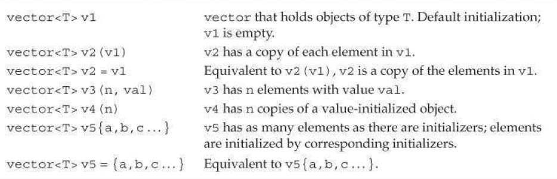
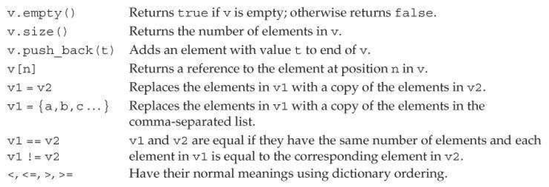

## defing and initializing
**??? templete and instance**
### way to initialization `vector`
similar to string initialization

### **list initializer** or **Element count**

    vector<int> a(10); // 10 elements
    vector<int> a{10}; // 1 element which is 10
    vector<int> a(10,1);
    vector<int> a{10,1};
***
## adding elements to vector
using `push_back()`

**we can change size of vector dynamically,
but can't in a *range for* loop**

## vector operations

