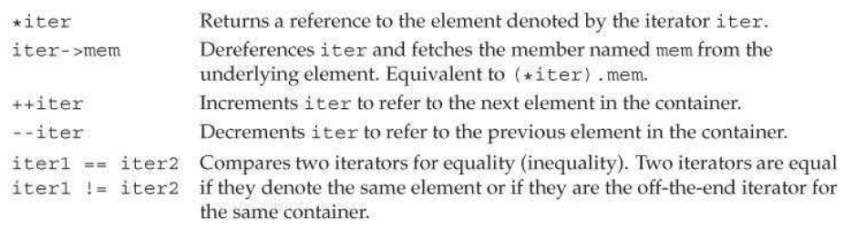
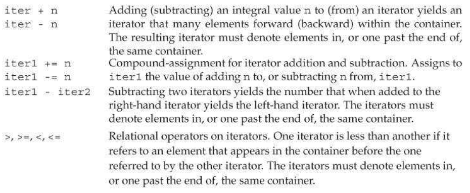

## using iterators
    auto a = s.begin();
    auto b = s.end();
### iterator operations

attention to the *iter* return a **reference** to the element.
### `cbegin()` and `cend()`
return a iterator<T>::const_iterator

**loop that use iterators can't add element to the container to which the iterator refer**
***
## iterator Arithmetic
Operations Supported by vector and string Iterators

***
## binary search using iterator

```cpp
// may be not correct

auto begin = a.begin(), end = a.end();
auto mid = begin + (begin + end) / 2;
while (begin != end)
	{
        if (*mid > target)
		{
			end = mid;
		}
		else if (*mid < target)
		{
			begin = mid;
		}
		else
			break;
		mid = begin + (end - begin) / 2;
	}
	if (begin == end)
	   cout << "not found";
    else
	   cout << *mid;

```
